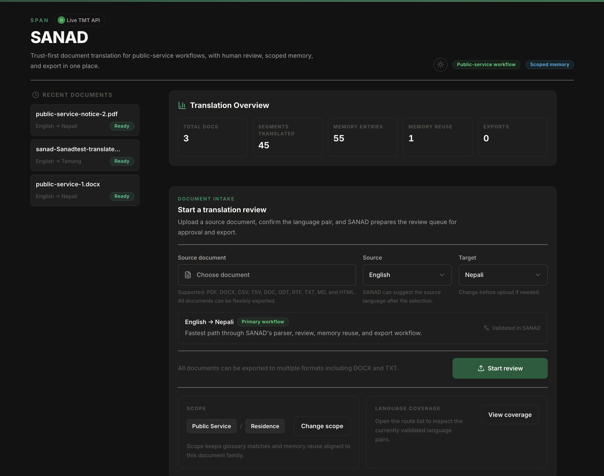
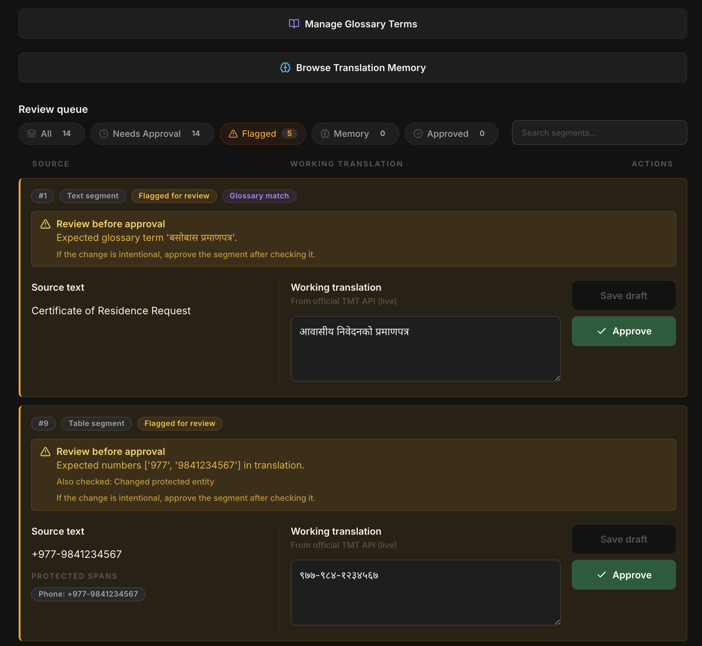

# SANAD: Trust-First Public-Service Document Translation

SANAD is a prototype for public-service document translation. It combines parsing, protected-entity checks, scoped memory, human review, and export in a FastAPI backend with a React/Vite UI.

```
Upload -> Parse -> Protect -> Memory -> Provider -> Review -> Export / Feedback pack
```

## Preview

### Dashboard & Intake

*Translation overview and document intake*

---

### Review Interface

*Protected entity checks and glossary matches*


## What SANAD does

- Parses DOCX, PDF, CSV/TSV, and text documents into reviewable segments.
- Evaluates translations with a rule-based Risk Engine to flag formatting, number, and entity errors.
- Auto-repairs fixable translation errors by re-prompting the provider before human review.
- Reuses scoped translation memory with provenance.
- Exports translated files and a privacy-reduced feedback pack.

## Who it's for

Public-service teams that translate official notices and forms, with reviewers who need protected-entity checks, scoped memory reuse, and export-ready outputs.

## System layout

- Backend: FastAPI + SQLAlchemy (`apps/api`)
- Web UI: React + Vite (`apps/web`)
- Storage: SQLite + file storage
- PDF conversion: Gotenberg for non-PDF to PDF export

## Supported inputs

- DOCX, PDF, CSV, TSV, TXT
- DOC/ODT/RTF/HTML/MD are supported when `/usr/bin/textutil` is available (macOS)

## Languages

- English, Nepali, Tamang
- Providers normalize these codes for official and legacy TMT endpoints and fall back to a deterministic fixture provider when APIs are unavailable

## Quick start (Docker)

```bash
docker compose up --build -d
```

- Web UI: http://127.0.0.1:5173
- API docs: http://127.0.0.1:8000/docs

Note: `docker-compose.yml` defaults to `SANAD_ACTIVE_PROVIDER=fixture` unless you set it in the environment.

## Testing workflow

1) Generate test fixtures (writes to `samples/demo/`):

```bash
make fixtures
```

2) Reset application state:
- UI shortcut: `Shift + Option + R`
- API: `POST /api/debug/reset-demo`

3) Upload a sample document from `samples/demo/`.
4) Process, review, approve, and export.
5) Download the feedback pack after all segments are approved.

## Local development

Backend (Python 3.12+):

```bash
cd apps/api
python -m venv .venv
source .venv/bin/activate
pip install -e ".[dev]"
make backend
```

Frontend:

```bash
cd apps/web
npm install
make frontend
```

## Configuration

Copy `.env.example` to `apps/api/.env` and set values as needed:

```bash
SANAD_DATABASE_URL=sqlite:///./sanad.db
SANAD_STORAGE_ROOT=./storage
SANAD_ACTIVE_PROVIDER=tmt_api
SANAD_TMT_OFFICIAL_ENDPOINT=https://tmt.ilprl.ku.edu.np/lang-translate
SANAD_TMT_API_ENDPOINT=https://tmt.ilprl.ku.edu.np
SANAD_TMT_API_KEY=
SANAD_TMT_AUTH_METHOD=none
SANAD_TMT_ENABLE_FALLBACK=true
SANAD_TMT_PROVIDER_BATCH_SIZE=25
SANAD_TMT_CONCURRENCY=8
SANAD_TMT_RATE_LIMIT_DELAY=0.05
SANAD_GOTENBERG_URL=http://gotenberg:3000
```

## Testing and validation

```bash
make test-api
make demo-check
make smoke-tmt-directions
```

## Platform notes

- DOC/ODT/RTF/HTML parsing uses `/usr/bin/textutil` (macOS). On Linux, use DOCX or TXT.
- PDF export uses PyMuPDF for PDF-to-PDF and Gotenberg for non-PDF to PDF conversion.
- Devanagari PDF rendering depends on system fonts; results vary by OS.

## More docs

- [docs/ARCHITECTURE.md](docs/ARCHITECTURE.md)
- [docs/EVALUATION_MAP.md](docs/EVALUATION_MAP.md)
